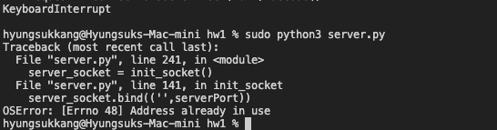

# HW1 Report
 
# 1. TCP로 웹서버 제작

# 1-1. HTTP packet parsing

TCP는 HTTP의 기반이 되므로 HTTP 통신에 대한 정보를 여과 없이 받아 들일 수 있다. 웹서버는 HTTP를 메소드와 url로 구분하여 처리하는데 이를 이용하여 임의의 HTTP 패킷을 파싱하여 메소드와 url을 끄집어 내도록 한다.

HTTP패킷을 파싱하여 메소드와 url을 끄집어 내는 코드는 아래와 같다.

```python
def recv_http_data(conn):
    data = b""
    while True:
        chunk = conn.recv(1024)
        if len(chunk) < 1024:
            return data + chunk
        else:
            data += chunk


connectionSocket, addr = server_socket.accept()
request = recv_http_data(connectionSocket)
headers = request.split(b'\n')
#print(headers[0]) # <CODE(GET/PUT/POST/DELETE)> <URL> <HTTP Connection version>
method =  headers[0].split()[0]  
url = headers[0].split()[1] 
```

# 1-2. HTTP packet submission

이제 파싱을 통해 웹서버와 같이 메소드와 url을 구분할 수 있게 되었으므로 각 상황에 따른 대답을 해보도록 한다. 
우선 HTTP response 패킷을 만들기 위해서는 `<사용하는 http 통신 프로토콜> <상태코드 200/404/403> <서버 상태>` 를 먼저 만들어야 한다. 각각에 대한 헤더 제작법은 w3school에서 찾아볼 수 있다.

우선 200의 경우 헤더를 만든 뒤 html을 더하는 게 가능하다.
```python
def send_http_response(socket, filename):
    try:
        htmlFS = open('html' + filename)
        content = htmlFS.read()
        htmlFS.close()
        response = 'HTTP/1.0 200 Ok\n\n' + content
        socket.sendall(response.encode())
    except IOError:
        print("html file does not exist on:", filename)
```

404와 403의 경우 상태코드 기준을 따라주면 브라우져에서 알아서 관련된 에러 페이지를 보여주므로 헤더와 간단한 커멘트를 넣어준다.
```python
def send_403(socket):
    response = 'HTTP/1.0 403 Forbidden\n' + '<h1>Forbidden</h1>'
    socket.sendall(response.encode())


def send_404(socket):
    response = 'HTTP/1.0 404 Not Found\n' + '<h1>Not Found</h1>'
    socket.sendall(response.encode())
```

# 1-3. HTTP POST method processing


[HTTP POST sequence diagram](https://www.eventhelix.com/networking/HTTP_Post.pdf)
HTTP Post 데이터의 경우 connnection을 먼저 확인 한 후 데이터를 보내므로 위 문서와 같이 `HTTP Continuation` 단계의 패킷 신호들을 잡아내려면 소켓이 계속 패킷들을 읽을 수 밖에 없다.
HTTP 헤더를 꺼내와서 정해진 content-length만큼 읽을 수 있겠으나 좀 더 안전한 데이터 수급을 위해 권장하는 1024 바이트만큼 끊어 읽다가 읽어야할 데이터 메모리가 1024 바이트보다 작아지면 받는 걸 멈추도록 한다.

```python
def recv_http_data(conn):
    data = b"" # placeholder
    while True:
        chunk = conn.recv(1024)
        if len(chunk) < 1024: # 읽어야할 데이터 메모리가 1024 바이트보다 작아질 때 까지
            return data + chunk # 읽어서 추가한다.
        else:
            data += chunk
```

이후 TCP(ACK)을 HTTP(200) 형식에 맞춰서 데이터를 보내 리턴한다.

```python
def send_http_response(socket, filename):
    try:
        htmlFS = open('html' + filename)
        content = htmlFS.read()
        htmlFS.close()
        response = 'HTTP/1.0 200 Ok\n\n' + content
        socket.sendall(response.encode())
    except IOError:
        print("html file does not exist on:", filename)
```

# 1-4. 서버 파일 삭제

현재 우리가 사용하는 HTML5는 POST와 GET 메소드만 사용하고 있다. 따라서 url input을 이용한 GET 메소드로 처리해준다. 

유저마다 할당되는 storage html에 url input이 들어간 링크를 실행시켜주는 버튼을 만든다.
```python
def edit_user_storage_html(user):
    # get list of files in files directory
    filelist = get_file_list(f'{user}')
    # edit storage.html
    htmlFS = open('html' + '/storage.html')
    content = htmlFS.read()
    htmlFS.close()

    # replace user1 with received username
    pattern = re.compile(r"user1")
    change_user = pattern.sub(user, content)
    
    # find ul in storage.html with finding ul pattern
    pattern = re.compile(r"\<ul[^\>]*\>\s*\<\/ul\>")
    # replace it with mad html
    html = "<ul>"
    for i in filelist:
        list_element = f"<li>{i} <a href=\"/{user}/{i}\" download><button>Download</button></a> <a href=\"/delete/{user}/{i}\"><button>Delete</button></a> </li>"
        html+=list_element
    html+="</ul>"
    result = pattern.sub(html, change_user)
    return result
```

그 후 서버 측에서 url input을 받아 서버 디렉토리에서 삭제시켜준다. url input이 띄어쓰기나 파일 이름에 쓰일 수 있는 다양한 표기들을 url에서는 %20(' ') 와 같이 다르게 표현하기 때문에 `urllib` 모듈을 이용해서 파싱을 해준다.
```python
def delete_file(user, file):
    remove(f"{user}/{file}")
elif url.startswith(b'/delete'):
                if login_cache == "" or check_cookie(login_cache) == False:
                    send_403(connectionSocket)
                else:
                    # unquote url input to unicode string
                    url_input = unquote(url).split('/')
                    if len(url_input) > 4:
                        send_404(connectionSocket)
                    else:
                        user, file = url_input[2], url_input[3] 
                        # delete file 
                        delete_file(user, file)
                        html = edit_user_storage_html(login_cache)
                        send_http_response_html(connectionSocket, html)


```

# 1-5. 쿠키 관리 

쿠키는 로그인을 했을 시 `login_cache`에 현재 로그인한 유저 네임을 타임스탬프를 기록하여 `/cookie.html` GET request를 했을 시 타임스탬프가 보이게 한다.

서버에서 유저와 관련된 url로 리퀘스트를 받을 때마다 `check_cookie` 함수를 실행시켜 다른 유저가 로그인 없이 storage에 접근하는 것을 막는다.

```python
def check_cookie(user):
    if user == "":
        return False
    cookieFS = open('cookies' + f'/{user}')
    content = cookieFS.read()
    cookieFS.close()
    diff = (time() - float(content))
    return diff <= 120
```

`check_cookie`가 사용되는 url로는 /delete/*, /storage, /cookie.html 이 있다. 이들 모두 cookie가 만료되거나 로그인을 안했을 시 403 error를 보내게 한다.

`/delete` 의 경우
```python
            elif url.startswith(b'/delete'):
                if login_cache == "" or check_cookie(login_cache) == False:
                    send_403(connectionSocket)
                else:
                    url_input = url.split(b'/')
                    user, file = url_input[2], url_input[3] 
                    # delete file 
                    delete_file(user, file)
                    html = edit_user_storage_html(login_cache)
                    send_http_response_html(connectionSocket, html)
```

`/storage`의 경우
```python
            # Exceptions on user customized page
            if url == b'/storage':
                # check cookie
                if check_cookie(login_cache):
                     html = edit_user_storage_html(login_cache)
                     send_http_response_html(connectionSocket, html)
                else:
                    login_cache = ""
                    send_403(connectionSocket)
```
```python
def process_storage(packet, login_cache, connectionSocket):
    user = re.compile(b'(?<=name="id"\\r\\n\\r\\n)(.*?)(?=\\r\\n------)').search(packet)
    if user != None: 
        login_cache = process_login(packet, connectionSocket)
    else:
        if login_cache == "": #POST request를 로그인 없이 새로고침으로 보낼 때
            send_403(connectionSocket)
        else:
            print("upload request from /storage, change to upload")
            # get http post file inputs
            file = recv_http_data(connectionSocket)
            login_cache = process_upload(file, login_cache, connectionSocket)
    return login_cache
```

`/cookie.html`의 경우
```python
            # cookie management
            elif url == b'/cookie.html':
                # send edited html
                if check_cookie(login_cache):
                    html = edit_user_cookie_html(login_cache)
                    send_http_response_html(connectionSocket, html)
                elif login_cache == "":
                    send_403(connectionSocket)
                else:
                    send_http_response(connectionSocket, '/index.html')
```

위와 같은 코드들로 처리한다.

cookie.html 같은 경우 유저가 로그인 했을 때 타임스탬프를 찍어 리퀘스트를 보낸 시점의 차를 구해 cookie의 만료 시간을 결정한다.

```python

def edit_user_cookie_html(user):
    # get list of files in files directory
    filelist = get_file_list(f'{user}')
    # edit storage.html
    htmlFS = open('html' + '/cookie.html')
    content = htmlFS.read()
    htmlFS.close()

    # replace user1 with received username
    pattern = re.compile(r"user1")
    change_user = pattern.sub(user, content)
    
    # find ul in storage.html with finding ul pattern
    pattern = re.compile(r"27")
    cookieFS = open('cookies/' + user)
    content = cookieFS.read()
    cookieFS.close()
   
    # replace time in html
    tdiff = time() - float(content)
    left = str(120 - tdiff)
    result = pattern.sub(left, change_user)
    return result
```

## Appendix

keep-alive 옵션을 통한 소켓을 통해 클라이언트와 연결이 되면 클라이언트와 커넥션을 끊어도 세션이 연결되는 것을 볼 수 있다.

아래 사진은 KeyboardInterrupt로 클라이언트와 연결 되어 있던 서버의 커넥션을 껐는데도 세션이 유지되어 서버를 새로 돌릴 수 없음을 보여준다.


반면 클라이언트와 커넥션이 없을 시 바로 다시 킬 수 있다.